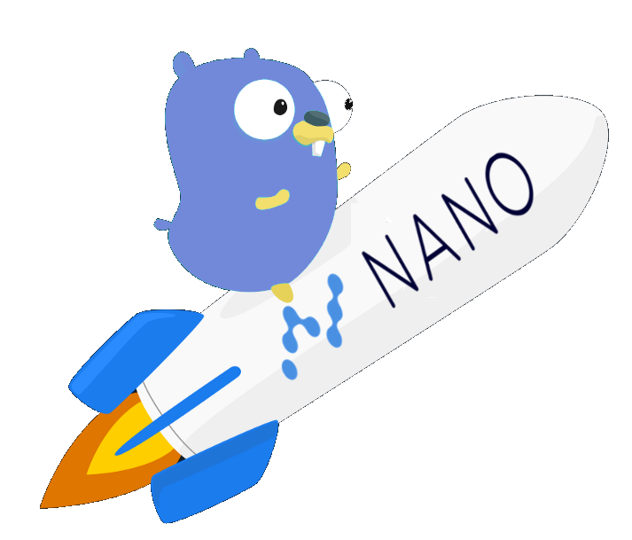

# go-nano

A Discord bot for tracking [Nano](https://nano.org/en)

### Running

`go run main.go --TOKEN="PUT YOUR TOKEN HERE"`

or with environment vars

`go run main.go` 

### Commands

* **?go price** - Show nano price
* ~~**?go news**~~ - Show nano news (TODO)

### Why Golang?

To learn Golang

### License
This project is licensed under the MIT License - see the [LICENSE](LICENSE) file for details
